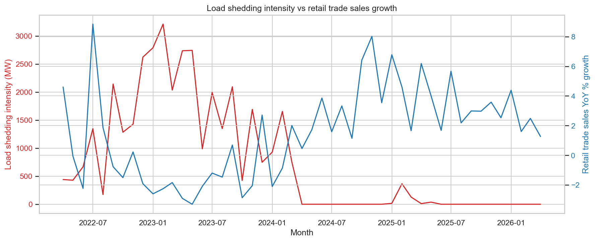
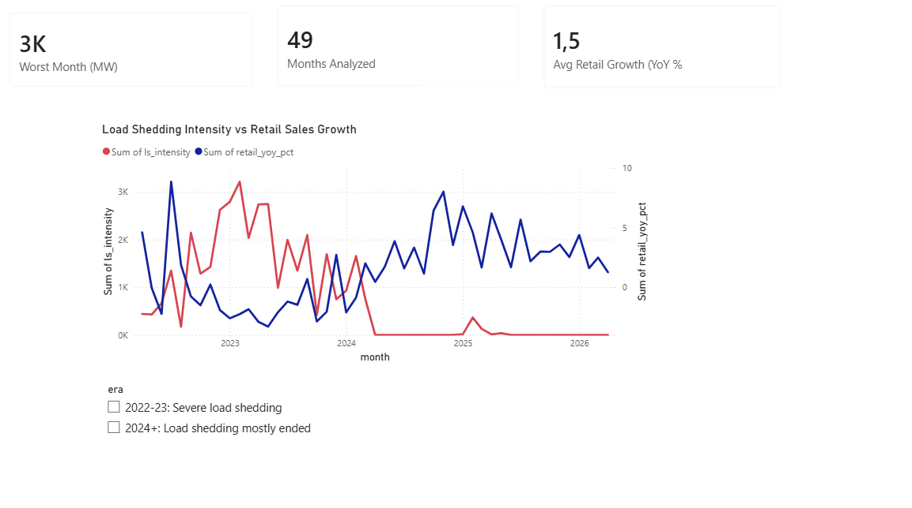

# Load Shedding's Economic Ripple Effect

**Does the severity of Eskom's load shedding measurably move South African retail trade sales — and by how much?**

## Key Finding

Yes. Across 49 months of real, matched data (April 2022 – April 2026), heavier load shedding was reliably associated with weaker retail trade sales growth: **r = -0.649 (p < 0.0001, 95% CI: -0.786 to -0.450)**. This holds even after controlling for the general upward drift in retail sales over time. The difference between a calm month (0 MW of manual load reduction) and Eskom's worst month (3,213 MW) is associated with an estimated **6.0 percentage-point swing in retail trade sales growth (95% CI: 3.0 to 9.1 points)**.

---

## Project Overview

A data-driven investigation into how the severity of Eskom's grid deficits — measured by **Manual Load Reduction (MLR)**, the official megawatt figure ordered by the National Control Centre — correlates with, and potentially predicts, shifts in South African retail trade sales.

This project combines two real, official South African data sources, applies formal statistical testing (Pearson correlation, p-values, 95% confidence intervals), tests for lagged/delayed effects, and builds a regression model that quantifies the relationship in real-world terms rather than stopping at "a correlation exists."

Built as a portfolio project for a BSc IT (Data Science) final-year student applying to the Big Data Analytics postgraduate program at Wits University.

## Repository Structure

```
├── README.md                  # This file
├── notebooks/
│   └── 01_loadshedding_economy_analysis.ipynb   # Full analysis pipeline
├── data/
│   ├── raw/                   # Untouched original downloads + SOURCES.md
│   └── processed/
│       └── monthly_merged.csv # Cleaned, merged monthly dataset
├── charts/
│   └── 01_timeseries_overlay.png
├── dashboard/
│   └── dashboard.pbix         # Interactive Power BI dashboard
├── reports/
│   └── Load_Shedding_Research_Report.docx
└── requirements.txt
```

## Data Sources

| Source | What it provides | Granularity |
|---|---|---|
| [Eskom Data Portal](https://www.eskom.co.za/dataportal) | Manual Load Reduction (MLR) in MW — the actual electrical deficit ordered by the National Control Centre | Hourly, aggregated to monthly averages for this analysis |
| [StatsSA P6242.1](https://www.statssa.gov.za/) | Retail trade sales, constant 2019 prices ("Total," actual values) | Monthly |

Exact access dates and source URLs are logged in [`data/raw/SOURCES.md`](data/raw/SOURCES.md).

## Methodology

1. **Cleaning & alignment** — Eskom's hourly MLR readings were aggregated into monthly averages. StatsSA's wide-format sheet (one row per category, one column per month) was reshaped into a standard monthly time series, and year-on-year percentage growth was calculated directly from the raw Rand values. The two series were merged on month, keeping only months present in both.
2. **Statistical testing** — Pearson correlation with 95% confidence intervals (via Fisher z-transformation), tested at lags 0–4 months to check for a delayed effect.
3. **Modelling** — OLS regression of retail YoY growth on load shedding intensity, controlling for a linear time trend, to isolate the effect of load shedding from the general trend in the data.

## Findings

- **Contemporaneous correlation:** r = -0.649, p < 0.0001, n = 49, 95% CI [-0.786, -0.450]
- **Lag analysis:** Significant at every lag from 0–4 months (r ranging from -0.649 to -0.698), with no meaningful decay. This flat pattern most likely reflects two distinct eras in the data — severe, sustained load shedding through 2022–2023 giving way to its near-complete disappearance from 2024 onward — rather than a precise month-specific delay.
- **Regression:** Load shedding intensity remains a significant predictor (coefficient = -0.0019 percentage points per MW, p < 0.001) even after controlling for time (p = 0.590, not significant on its own) — indicating load shedding itself, not simply the passage of time, is doing the explanatory work.

Full narrative and code: [`01_loadshedding_economy_analysis.ipynb`](notebooks/01_loadshedding_economy_analysis.ipynb)
Full written report (3–5 pages): [`Load_Shedding_Research_Report.docx`](reports/Load_Shedding_Research_Report.docx)



## Interactive Dashboard

A companion Power BI dashboard (`dashboard/dashboard.pbix`) extends the static analysis above into an interactive view. It includes:

- A dual-axis line chart of load shedding intensity against retail sales growth, month by month
- A slicer that filters the chart by era ("2022-23: Severe load shedding" vs. "2024+: Load shedding mostly ended"), so the regime shift discussed in the Limitations section below can be explored directly rather than only read about
- Headline KPI cards: worst month on record (3,213 MW), total months analyzed (49), and average retail sales growth across the full period

Requires Power BI Desktop (free) to open — GitHub does not render `.pbix` files directly in the browser.



## Limitations

- **Correlation ≠ causation** — load shedding intensity co-moves with the broader business cycle.
- **Confounders:** COVID-19 lockdowns (2020–21), the interest-rate cycle, fuel prices, and the July 2021 riots all unfold across the same period.
- **Regime note:** sustained load shedding largely ended in 2024, so the informative variance in the data mostly sits in 2019–2023.
- **Multicollinearity:** load shedding intensity and the passage of time are closely related in this dataset, making it hard to fully isolate one effect from the other — the regression coefficient should be read as indicative of magnitude, not a precise causal isolate.
- Sample size at monthly granularity is modest (n = 49); wide confidence intervals are expected and reported honestly throughout.

## Setup & How to Run

```bash
git clone <this-repo-url>
cd loadshedding-economy
pip install -r requirements.txt
jupyter notebook
```

Then open `notebooks/01_loadshedding_economy_analysis.ipynb` and run all cells top to bottom. Raw data files are already included in `data/raw/`; the notebook reads directly from the zip archives without unpacking them.

To view the interactive dashboard, open `dashboard/dashboard.pbix` in Power BI Desktop.

---

*Portfolio project · BSc IT (Data Science) · July 2026*
